# 🚀 Rapport de Projet Cloud Serverless : Gestion de Commandes

Ce document détaille la mise en œuvre d'une architecture **Cloud-Native Serverless** entièrement simulée localement avec **LocalStack**. L'objectif est de reproduire un environnement de production AWS pour gérer un cycle de vie complet de commandes via une API REST.

---

## 🏗️ Architecture du Système

L'infrastructure repose sur l'intégration de plusieurs services AWS fondamentaux, orchestrés pour offrir une solution scalable et sans serveur.

### 🔹 Schéma de Flux
`Client (Postman/Curl)` ➔ `API Gateway` ➔ `AWS Lambda` ➔ `DynamoDB`

### 🔹 Rôle des Composants
| Service | Fonction technique |
| :--- | :--- |
| **API Gateway** | Point d'entrée sécurisé exposant les ressources REST (`/orders`). |
| **AWS Lambda** | "Cerveau" du système gérant la logique métier (Routage CRUD). |
| **DynamoDB** | Base de données NoSQL persistante pour le stockage des commandes. |
| **IAM** | Gestion des permissions entre les services (Least Privilege). |
| **LocalStack** | Émulateur cloud permettant le test de l'infrastructure sans coût. |

---

## ⚙️ Analyse de la Logique Backend (`lambda_function.py`)

La fonction Lambda agit comme un contrôleur centralisé. Voici les points clés de son implémentation :

### 1. Routage Dynamique
La fonction utilise l'objet `event['httpMethod']` pour diriger la requête vers la bonne opération DynamoDB :
- **POST** : Génère un `orderId` unique (UUID) et insère l'objet dans la table.
- **GET** : Effectue un `scan` complet de la table pour retourner la liste des commandes.
- **DELETE** : Supprime une entrée spécifique basée sur l'ID fourni dans le corps de la requête.

### 2. Gestion de la Sérialisation (Boto3 & JSON)
> [!IMPORTANT]
> DynamoDB utilise le type `Decimal` pour les nombres, ce qui n'est pas nativement supporté par la bibliothèque `json` de Python.
> **Solution** : Une fonction utilitaire `convert_decimals` transforme récursivement les objets `Decimal` en `int` ou `float` avant de renvoyer la réponse au client.

### 3. Connectivité LocalStack
```python
boto3.resource('dynamodb', endpoint_url='http://host.docker.internal:4566')
```
L'utilisation de `host.docker.internal` permet à la Lambda (exécutée dans son propre conteneur) de communiquer avec le service DynamoDB exposé par LocalStack.

---

## 🧪 Journal d'Exécution et Preuves Techniques

Le projet a été déployé en suivant un cycle de vie rigoureux. Voici les étapes détaillées avec leurs preuves visuelles respectives.

### Phase 1 : Initialisation de l'Infrastructure
1. **Lancement des Services** : Initialisation via Docker Compose (Version 3.0.2).
   > 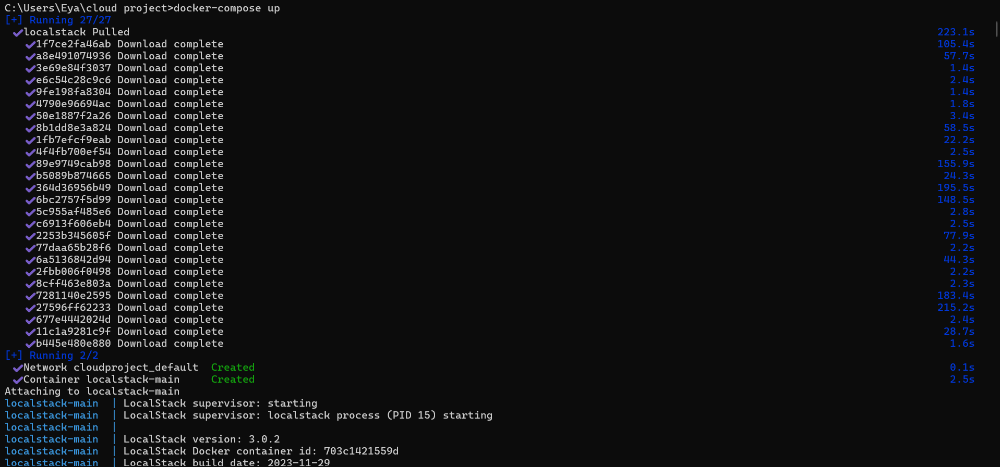

2. **État Initial** : Vérification de la vacuité de l'environnement (aucune table DynamoDB).
   > 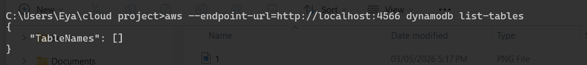

### Phase 2 : Couche de Persistance (DynamoDB)
3. **Création de la Table** : Mise en place de la table `orders` avec une clé primaire `orderId`.
   > 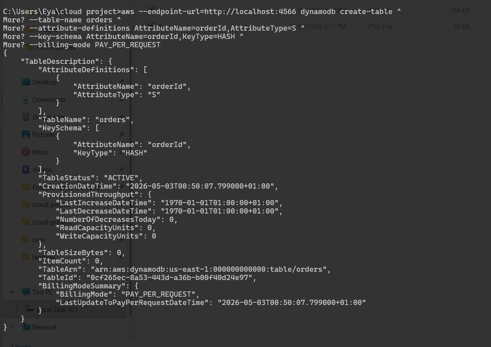

4. **Validation de la Table** : Confirmation de la présence de la ressource.
   > 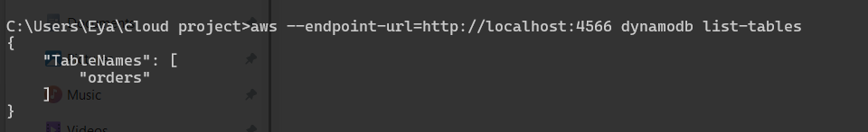

### Phase 3 : Logique Métier (AWS Lambda)
5. **Compilation** : Packaging du script Python dans un artéfact `.zip`.
   > 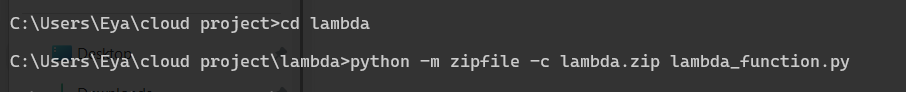

6. **Déploiement** : Création de la fonction `ordersFunction` (Runtime Python 3.9).
   > 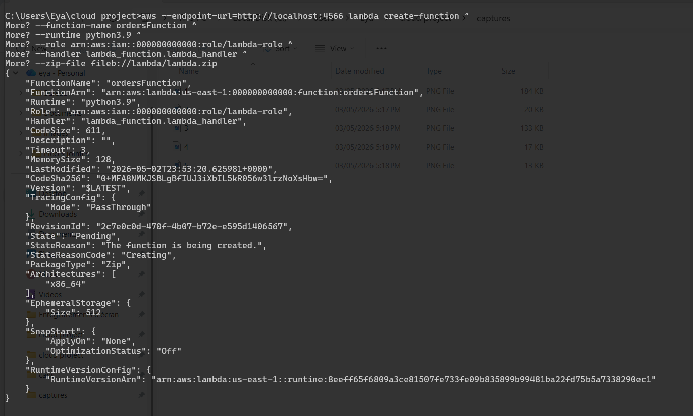

7. **Test Unitaire** : Premier test d'invocation directe de la Lambda.
   > 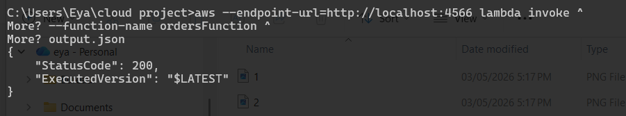

### Phase 4 : Exposition via API Gateway
8. **Création de l'API** : Initialisation de la REST API "orders-api" (ID: `i5typl11my`).
   > 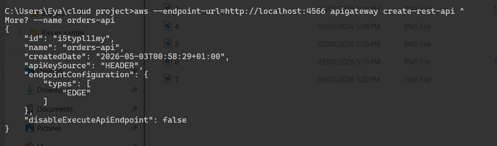

9. **Structure des Ressources** : Identification de l'ID racine (`/`).
   > 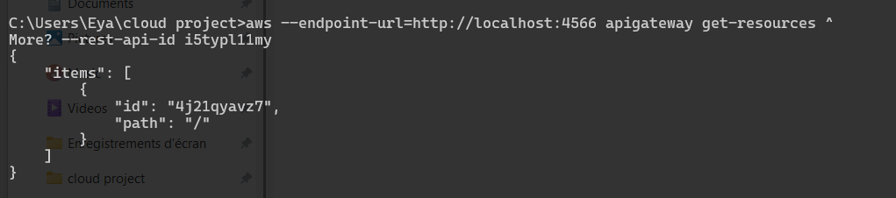

10. **Point de Terminaison** : Création de la ressource enfant `/orders`.
    > 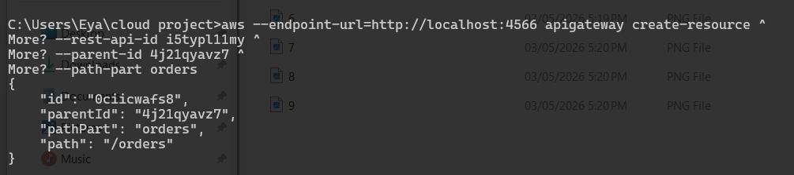

### Phase 5 : Implémentation du Cycle CRUD
11. **Méthode POST** : Configuration du verbe de création.
    > 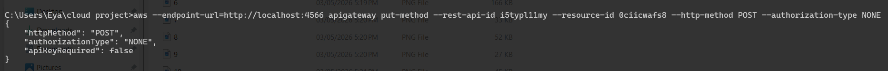

12. **Intégration Proxy** : Liaison avec la Lambda via `AWS_PROXY`.
    > 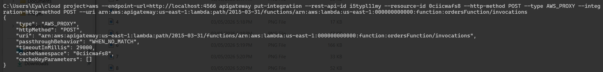
        
13. **Autorisations** : Ajout des permissions pour permettre à l'API d'appeler la Lambda.
    > 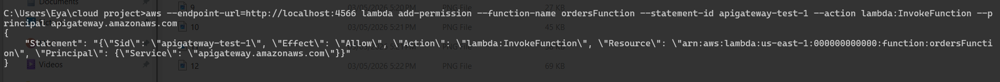

14. **Déploiement (Dev)** : Publication de l'API sur le stage de développement.
    > 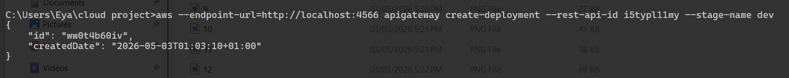

15. **Validation POST** : Premier test de création d'une commande via `curl`.
    > 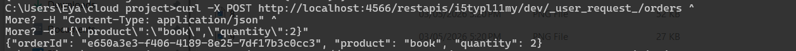
    

16. **Méthode GET** : Configuration de la récupération de données.
    > 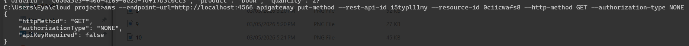


17. **Intégration GET** : Liaison de la lecture avec la Lambda.
    > 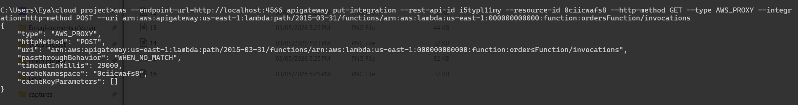

18. **Mise à jour API** : Nouveau déploiement pour inclure le GET.
    > 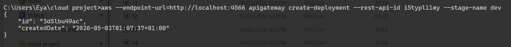

19. **Validation GET** : Récupération de la liste des commandes.
    > 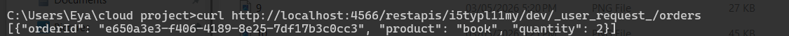

20. **Méthode DELETE** : Configuration de la suppression.
    > 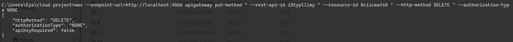

21. **Intégration DELETE** : Liaison de la suppression avec le Backend.
    > 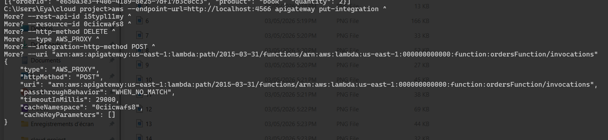
    
22. **Déploiement Final** : Publication de la version complète de l'API.
    > 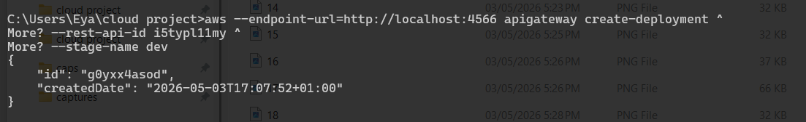
   

23. **Test de Cycle Complet** : Validation de la suppression et vérification de la table vide.
    > 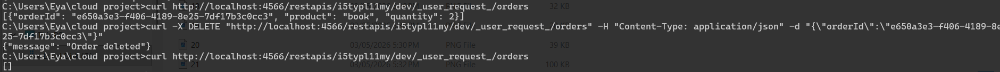
    
---

## 🏁 Tests de Validation (Postman)

Pour finaliser la validation, nous avons utilisé un client API professionnel (Postman) afin de tester les endpoints réels :
**URL de base** : `http://localhost:4566/restapis/i5typl11my/dev/_user_request_/orders`

1. **Test de Création (POST)** : Envoi d'un corps JSON pour générer une commande.
   > 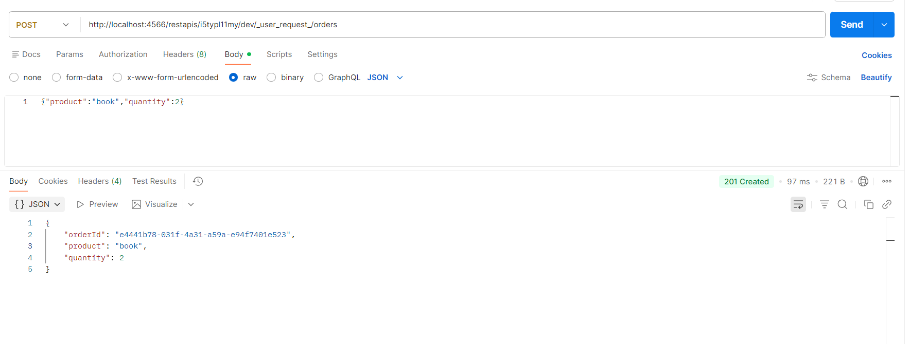


2. **Test de Lecture (GET)** : Récupération de la base de données.
   > 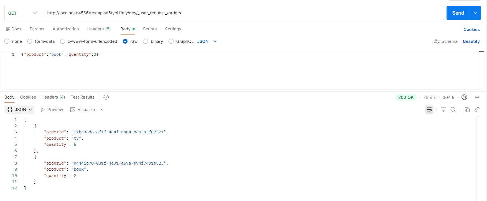

3. **Test de Suppression (DELETE)** : Nettoyage de la base de données.
   > 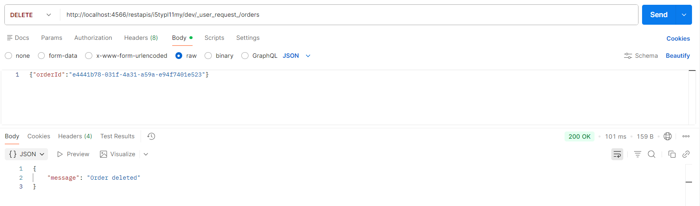

---

## ✅ Validation finale du système
Le système a été testé avec succès sur les 3 opérations CRUD :
✔ POST : création d'une commande avec génération d'un orderId unique
✔ GET : récupération des données depuis DynamoDB
✔ DELETE : suppression d'une commande par identifiant
La cohérence des données a été vérifiée directement dans DynamoDB via scan. 

## 📊 Résultat final 
- API Gateway : fonctionnelle 
- Lambda : correctement déclenchée 
- DynamoDB : persistance validée 
- LocalStack : simulation AWS stable 

Le cycle complet de microservice est opérationnel, conforme au modèle serverless AWS (API Gateway → Lambda → DynamoDB).
